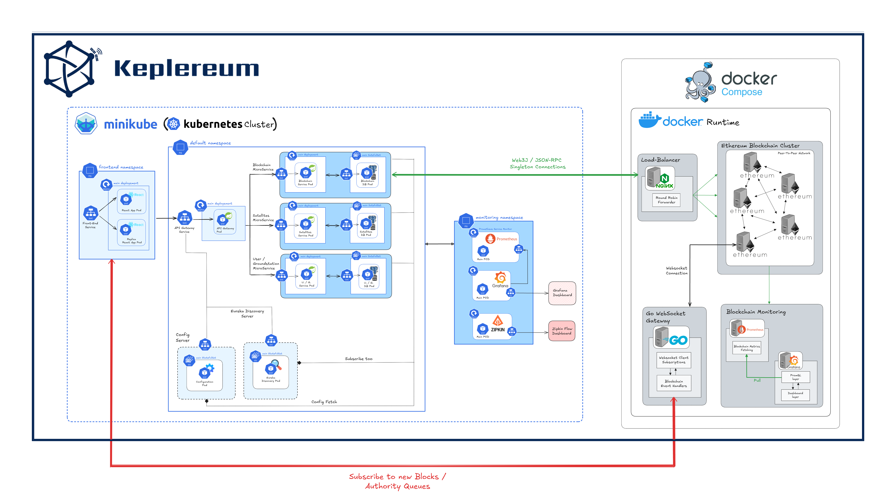
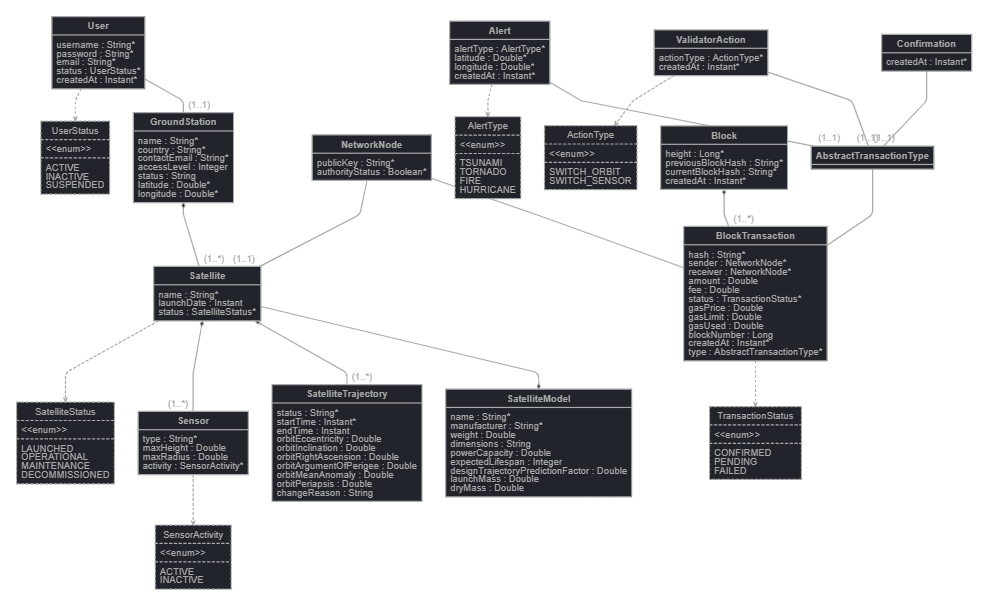
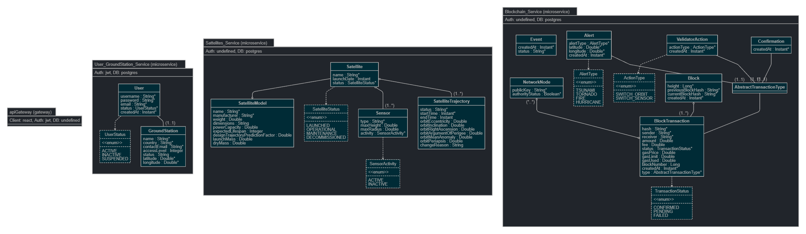
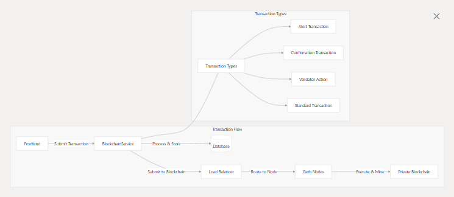
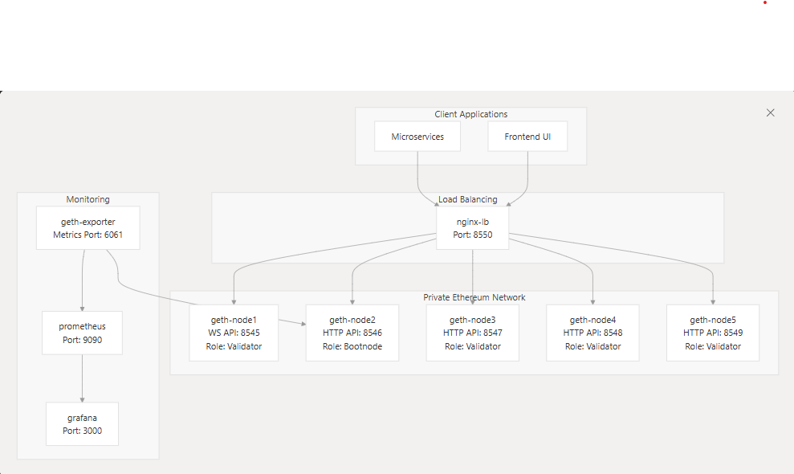
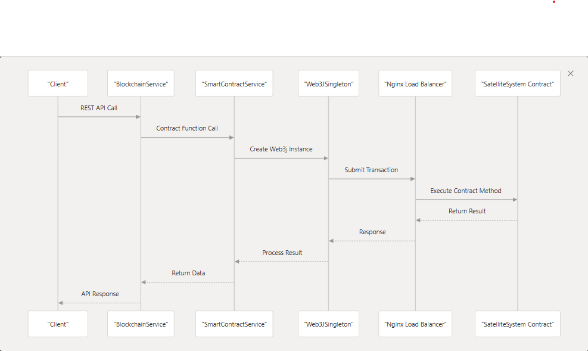

# Keplereum: Ethereum Decentralized Satellite Communication Network
> Last Updated: 26 May 2025

## Overview
Keplereum is a decentralized satellite communication system built on Ethereum blockchain technology. It enables secure, tamper-proof, and efficient data transmission between satellites and ground stations through a microservices architecture that integrates space technology with blockchain capabilities.

## System Purpose and Scope

Keplereum serves as a comprehensive platform for:

1.  Managing satellite operations and ground stations
2.  Recording critical satellite events and alerts on an immutable blockchain
3.  Providing real-time monitoring and visualization of satellite data
4.  Ensuring secure authentication and authorization of system users
5.  Validating and verifying satellite communications through a distributed consensus mechanism

## High-Level Architecture

Keplereum follows a microservices architecture with a clear separation of concerns:

## Monolith & Microservices Class Diagram

---

## Core Components

### 1. API Gateway
The API Gateway serves as the central entry point for all client requests, handling routing, authentication, and security concerns. It routes requests to the appropriate microservices based on the URL path.

### 2. Backend Microservices

#### User & Ground Station Service

Manages user accounts, authentication, and ground station information. This service is responsible for:

-   User registration and authentication
-   JWT token generation
-   Ground station management
-   Authorization of satellite operations

#### Satellite Service

Handles satellite operations, tracking, and sensor data. This service is responsible for:

-   Satellite registration and status tracking
-   Satellite trajectory calculation
-   Satellite sensor management
-   Communication with ground stations

#### Blockchain Service

Integrates with the private Ethereum blockchain to record and verify critical events. This service is responsible for:

-   Processing and storing blockchain transactions
-   Managing smart contracts
-   Network node validation
-   Alert system integration

### 3. Blockchain Infrastructure
Keplereum uses a private Ethereum blockchain network with multiple Geth nodes for transaction validation and smart contract execution. The blockchain is configured as:

-   Private network with NetworkID: 12345 (For Testing)
-   Multiple validator nodes (Geth instances)
-   Load-balanced through Nginx
-   Monitored with Prometheus and Grafana

## Technology Stack
| Component            | Technologies                                                                 |
|----------------------|-----------------------------------------------------------------------------|
| **Backend**          | Spring Boot, Spring Cloud, Spring Security, JPA, Go, NGINX                             |
| **Frontend**         | React, TypeScript, WebSocket                                                |
| **Database**         | PostgreSQL                                                                  |
| **Service Discovery**| Eureka                                                                      |
| **Configuration**    | Spring Cloud Config                                                         |
| **Distributed Tracing** | Zipkin, Micrometer                                                     |
| **Blockchain**       | Ethereum (Geth), Solidity Smart Contracts                                  |
| **Monitoring**       | Prometheus, Grafana                                                         |
| **Security**         | JWT Authentication                                                          |
---

## Blockchain Infrastructure
The Keplereum blockchain infrastructure is designed as a private Ethereum network with multiple nodes for redundancy, fault tolerance, and distributed consensus. This infrastructure provides the immutable ledger for recording critical satellite events, alerts, confirmations, and actions.

### Private Ethereum Network
The Keplereum blockchain is implemented as a private Ethereum network with the following characteristics:

-   **Network ID**: 12345 (for testing)
-   **Consensus Algorithm**: Clique (Proof of Authority)
-   **Block Time**: 120 seconds
-   **Gas Limit**: 8,000,000
-   **Chain Specification**: EIP-155 enabled to prevent replay attacks

The genesis block defines the initial state of the blockchain and includes configuration for all Ethereum protocol upgrades already activated from genesis.

### Geth Nodes Configuration
The infrastructure consists of five Ethereum nodes running go-ethereum (geth) client. Each node has a specific role in the network:

All nodes have the following configuration:

-   **Network ID**: 12345
-   **Sync Mode**: Full
-   **Mining Enabled**: Yes (PoA consensus)
-   **Gas Price**: 0 (free transactions)
-   **Transaction Pool Size**: 1024 slots
-   **API Modules**: eth, net, web3, personal, miner, clique, txpool
- 
### Load Balancer
The Nginx load balancer distributes incoming blockchain requests across all available Geth nodes. This provides:

-   **High Availability**: If one node fails, requests are redirected to operational nodes
-   **Load Distribution**: Prevents any single node from becoming a bottleneck
-   **Single Entry Point**: Exposes a unified API endpoint (port 8550) for all blockchain services

The Blockchain Service microservice connects to this load balancer rather than directly to individual nodes, as specified in its configuration.

### Smart Contracts
The Keplereum blockchain utilizes the  `SatelliteSystem`  smart contract to manage satellite-related data and events. This contract handles:

1.  **Alert Management**:
    
    -   Submission of new alerts from satellites
    -   Confirmation of alerts by other satellites/ground stations
    -   Storage of alert metadata (type, coordinates, status)
2.  **Action Triggering**:
    
    -   Commands to satellites based on confirmed alerts
    -   Recording of all satellite actions on the blockchain
3.  **Validator Functions**:
    
    -   Operations related to network validators
    -   Management of consensus participants

## Monitoring Infrastructure

The blockchain infrastructure includes comprehensive monitoring tools:

1.  **Geth Exporter**:
    
    -   Collects metrics from Ethereum nodes
    -   Exposes metrics on port 6061
    -   Monitors address balances, block creation, and network status
2.  **Prometheus**:
    
    -   Scrapes metrics from the Geth Exporter
    -   Stores time-series data about blockchain performance
    -   Configured to monitor all aspects of the blockchain
3.  **Grafana**:
    
    -   Provides visualization dashboards for blockchain metrics
    -   Allows for real-time monitoring of network health
    -   Enables alerts based on performance thresholds

This monitoring setup ensures the operations team can maintain visibility into the blockchain's performance and health.
## Demo Links
[Main Demo](https://drive.google.com/file/d/1QgRBYGIXICE6yn_chJQLGIOGzcgb3YVO/view?usp=drive_link "Main KEPLEREUM Demo")
[Actual Blockchain Monitoring](https://drive.google.com/file/d/1B5NoJdRDYW0m8flSNJyRVDDiNAY0juZf/view?usp=drive_link "Custom Blockchain Monitoring")

## Conclusion

Keplereum represents a cutting-edge integration of satellite technology with blockchain capabilities, providing a secure and verifiable platform for satellite operations management. The system's microservices architecture ensures scalability and modularity, while the blockchain integration adds a layer of immutability and auditability to critical satellite operations.
