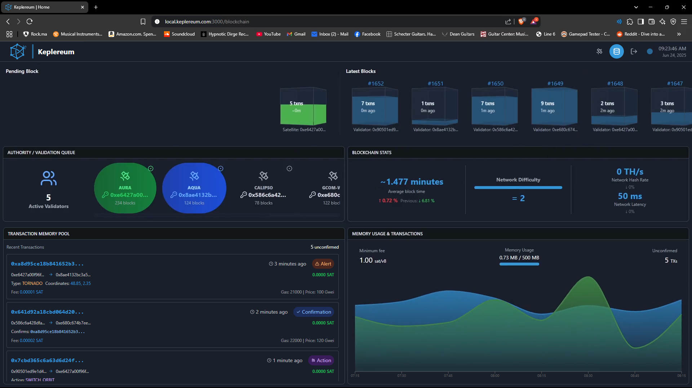
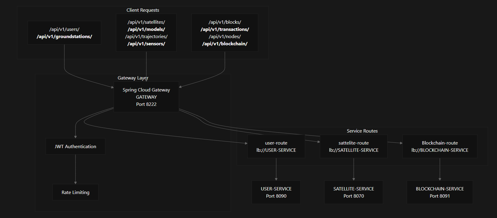

# Keplereum: Ethereum-based Decentralized Satellite Communication System
> Last Updated: 1st July 2025

## Overview
Keplereum is a decentralized satellite communication system built on Ethereum blockchain technology. It allows ground stations to track and manage their satellites, each through a dedicated private Ethereum Proof-of-Authority (PoA) blockchain. This architecture ensures secure, tamper-proof, and efficient transmission of satellite data.

##
At the core of Keplereum’s functionality is an **alert management system** developed using a Solidity smart contract, enabling satellites to autonomously trigger alerts and handle critically associated actions in a decentralized and verifiable manner. The entire system is orchestrated via a robust microservices architecture that seamlessly integrates space technology with blockchain capabilities.

## Team Members<a id="team-members"></a>
<table align="center">
    <tr>
        <td align="center" width="25%">
            
            <br /><span style="font-family: 'Segoe UI', Arial, sans-serif; font-weight: bold; font-size: 0.9em;">BIDIOUANE <br /> Haitam</span><br />
            <span style="font-family: 'Fira Mono', 'Consolas', monospace; font-size: 0.75em; color: #43a2e2;">(<b>@</b> sch0penheimer)</span>
            <br /> <br />
            <a href="https://github.com/sch0penheimer" 
            title="GitHub">
                    
            </a>
            &nbsp;
            <a href="https://www.linkedin.com/in/haitam-bidiouane/" 
            title="LinkedIn">
                    
            </a>
        </td>
        <td align="center" width="25%">
            
            <br /><span style="font-family: 'Segoe UI', Arial, sans-serif; font-weight: bold; font-size: 0.9em;">EL MOUDNI <br />Yassine</span><br />
            <span style="font-family: 'Fira Mono', 'Consolas', monospace; font-size: 0.75em; color: #43a2e2;">(<b>@</b> Mdn753)</span>
            <br /> <br />
            <a href="https://github.com/Mdn753" title="GitHub"></a>
            &nbsp;
            <a href="https://www.linkedin.com/in/el-moudni-yassine-064482333/" title="LinkedIn"></a>
        </td>
        <td align="center" width="25%">
            
            <br /><span style="font-family: 'Segoe UI', Arial, sans-serif; font-weight: bold; font-size: 0.9em;">FENGIRO <br /> Mohammed Arafa</span><br />
            <span style="font-family: 'Fira Mono', 'Consolas', monospace; font-size: 0.75em; color: #43a2e2;">(<b>@</b> Mharfe23)</span>
            <br /> <br />
            <a href="https://github.com/Mharfe23" title="GitHub"></a>
            &nbsp;
            <a href="https://www.linkedin.com/in/mohammedfengiro/" title="LinkedIn"></a>
        </td>
        <td align="center" width="25%">
            
            <br /><span style="font-family: 'Segoe UI', Arial, sans-serif; font-weight: bold; font-size: 0.9em;">YACOUBI <br /> Wail</span><br />
            <span style="font-family: 'Fira Mono', 'Consolas', monospace; font-size: 0.75em; color: #43a2e2;">(<b>@</b> WailYacoubi9)</span>
            <br /> <br />
            <a href="https://github.com/WailYacoubi9" title="GitHub"></a>
            &nbsp;
            <a href="https://www.linkedin.com/in/wail-yacoubi/" title="LinkedIn"></a>
        </td>
    </tr>
</table>

## Keplereum's Logo
<div style="padding-top: 20px; text-align: center;">
    
</div>

## **Table of Contents**
- [Project Presentation](#project-presentation)
- [High Level Software Architecture](#high-level-software-architecture)
- [Codebase Structure](#codebase-structure)
- [Frontend Components](#frontend-components)
    - [Satellite Tracking Dashboard](#satellite-tracking-dashboard)
        - [Satellite Trajectory Simulation (Keplerian Equations)](#satellite-trajectory-simulation-keplerian-equations)
        - [3D Visualization with Three.js](#3d-visualization-with-threejs)
        - [2D Earth Mapping](#2d-earth-mapping)
        - [Real-Time Telemetry Updates](#real-time-telemetry-updates)
    - [Blockchain Monitoring Dashboard](#blockchain-monitoring-dashboard)
        - [Latest Blocks](#latest-blocks)
        - [Authority Queue](#authority-queue)
        - [Real-Time Mempool Transactions](#real-time-mempool-transactions)
        - [Network Statistics](#network-statistics)
- [Core Backend Components](#core-components)
    - [API Gateway](#api-gateway)
    - [Service Discovery](#service-discovery)
    - [Configuration Management](#configuration-management)
    - [Security, Tracing & Monitoring](#security-tracing-monitoring)
    - [Backend Microservices](#backend-microservices)
        - [Monolithic and Microservices class diagrams](#class-diagrams)
        - [User & Ground Station Service](#user-ground-station-service)
        - [Satellite Service](#satellite-service)
        - [Blockchain Service](#blockchain-service)
            - [Blockchain Connection Design Patterns](#design-patterns)
        - [Deployment via Dockerfile (Multi-stage Maven JDK Build)](#multi-stage-docker-build)
- [Blockchain Infrastructure](#blockchain-infrastructure)
    - [Private Ethereum Networks](#private-ethereum-network)
    - [NGINX Load Balancer](#load-balancer)
    - [Go WebSocket Gateway](#go-websocket-gateway)
- [Deployment](#deployment)
    - [Docker Compose](#docker-compose)
    - [Kubernetes](#kubernetes)
- [CI/CD Pipeline](#cicd-pipeline)
    - [Jenkins Pipeline](#jenkins-pipeline)
    - [Docker Hub Integration](#docker-hub-integration)
    - [Testing](#testing)
- [Monitoring Infrastructure](#monitoring-infrastructure)
    - [Prometheus](#prometheus)
    - [Grafana](#grafana)
    - [Blockchain Monitoring](#blockchain-monitoring)
    - [Zipkin Distributed Tracing](#zipkin-distributed-tracing)
- [Demo Videos](#demo-videos)

# **Project Presentation**

**Keplereum** is a decentralized satellite communication framework, introducing the world’s first **decentralized satellite alert management system** based on Ethereum blockchain networks. It is designed as a **direct response** to the challenges outlined in [NASA’s technical report *“Blockchain Technology for Satellite Ground Station Communication: Application within a multi-sensor satellite architecture” (2018)*](https://ntrs.nasa.gov/api/citations/20180006549/downloads/20180006549.pdf), which calls for decentralized architectures to overcome limitations in traditional satellite-ground data flows such as **sensor manipulation and orchestration**.

---

||
|:----------------------------------:|
| The Official NASA's report: Blockchain Application within a multi-sensor satellite architecture  |

---

Keplereum establishes a **private Ethereum Proof-of-Authority (PoA) blockchain** for each ground station account, enabling secure and tamper-proof telemetry, alerting, and control messaging between its satellites (Each satellite represent an actual node in its groundstation's blockchain network). <br/>
At the heart of the platform is a **decentralized alert management system**, built using **Solidity smart contracts**, which allows satellites to issue, process, and confirm alerts in response to critical system or environmental events.

One of Keplereum’s **core innovations** is its focus on **decentralizing mission-critical actions** that have traditionally required centralized human oversight. These include:

- **Orbit-switching commands**  
- **Adjustments to sensor range or activation/deactivation**

While these operations often require **centralized human validation**, the underlying **data collection, alert propagation/confirmation, and final decision taking** mechanisms are now securely automated through **blockchain-based smart contracts**, enabling real-time, tamper-proof decision support without risking full centralization.

In doing so, Keplereum ensures that while **human intervention remains possible and necessary**, especially for high-risk maneuvers, the **system’s coordination, auditability, and integrity remain decentralized**.


## **Vision and Mission**

Keplereum envisions a future where **satellite-ground communication is decentralized, secure, and transparent**, free from single points of failure or centralized bottlenecks.

Our mission is to:

- **Automate alert management** via verifiable, smart contract-driven logic  
- Ensure **data integrity and operational transparency** across satellite networks  
- Enable **secure, controlled human intervention** only where required via global system monitoring  
- Provide a modular, interoperable architecture for future aerospace-blockchain integrations  
- Contribute a working implementation in response to ***NASA’s open challenge*** for decentralized space systems

---
### **Reference**
1. NASA’s technical report *“Blockchain Technology for Satellite Ground Station Communication: Application within a multi-sensor satellite architecture” (2018)*. [Link](https://ntrs.nasa.gov/api/citations/20180006549/downloads/20180006549.pdf)
---

# **High Level Software Architecture**
Keplereum follows a microservices architecture with clear separation of concerns, combining traditional enterprise patterns with blockchain integration. The system is designed around three main layers: ***frontend presentation***, ***backend services***, and for each connected ground/station, its **associated blockchain infrastructure**.

||
|:------------------------------------:|
| The High Level Architecture of Keplereum |

# **Codebase Structure**

The Keplereum codebase follows a modular architecture that promotes clear separation of concerns.

### **Root Directory Organization**
```HTML
Keplereum/
├─ Backend_microservice/      <!-- # Spring Boot microservices ecosystem # -->
├─ Blockchain/                <!-- # Ethereum blockchain infrastructure # -->
├─ Blockchain_WebSocket_Gateway/ <!-- # Dedicated Golang WebSocket Gateway # -->
├─ Design/                    <!-- # System architecture and design assets # -->
├─ FrontEnd/                  <!-- # React TypeScript application # -->
├─ K8s/                       <!-- # Kubernetes deployment configurations & manifests # -->
├─ assets/                    <!-- # Different assets used in the doc # -->
├─ README.md                  <!-- # Project's documentation # -->
├─ go.mod & go.sum            <!-- # Go dependencies for the WebSocket gateway # -->
└─ jenkinsfile                <!-- # CI/CD pipeline # -->
```


## **Backend Microservices Structure**

The backend follows Spring Cloud microservices patterns with dedicated services for different business domains: 

- **ConfigServer**: Centralized configuration management using the **Spring Cloud** Config
- **DiscoveryServer**: Service registration and discovery with Netflix Eureka
- **apiGateway**: API Gateway for routing, authentication, and cross-cutting concerns
---
- **User_GroundStation_Service**: User management and ground station operations
- **Satellites_Service**: Satellite tracking, telemetry, and orbital calculations
- **Blockchain_Service**: Ethereum blockchain integration and smart contract interactions


## **Frontend Application Structure**

The React application is built with modern TypeScript, featuring component-based architecture and efficient state management: 

- **components/**: Reusable UI components and specialized visualization modules
- **pages/**: Application routes and main view components
- **contexts/**: React global context providers for state management
- **hooks/**: Custom React hooks for business logic
- **utils/**: Utility functions and helper modules
- **types/**: TypeScript type definitions
- **data/**: Initial satellite mock data for alpha testing

<div align="center">

  
*Keplereum's modular frontend organization*

</div>

---

# **Frontend Components**

The Keplereum frontend delivers an immersive, real-time experience through sophisticated React components that seamlessly integrate: 1) **Satellite Space Visualization** and 2) **Blockchain Monitoring** capabilities. Built using **TypeScript** and leveraging **Three.js** for satellite 3D orbital rendering, the interface provides operators with comprehensive situational awareness and system control. 

## **Satellite Tracking Dashboard**

The satellite tracking dashboard serves as the central hub for space operations, providing multiple visualization modes and real-time telemetry data.

||
|:------------------------------------:|
| The Main Satellite Tracking Dashboard |

### **Satellite Trajectory Simulation (Keplerian Equations)**

Each ground station supplies the system with the orbital parameters of its satellites: (**perigee altitude** -  **eccentricity** - **inclination** - **argument of periapsis** - **Keplerian period**) to generate precise trajectory predictions. Keplereum simulates satellite trajectories to predict and visualize satellite positions with high accuracy.

**Key Features:**
- Real-time orbital parameter computation
- Multi-satellite trajectory prediction
- Orbital period and velocity calculations
- Sensor coverage area simulation
- Ground track visualization

<div align="center">


*Keplerian orbital mechanics simulation*

</div>

### **3D Visualization with Three.js**

The **Three.js**-powered 3D visualization engine creates an immersive Earth-satellite environment with photo-realistic rendering and smooth interactive controls. Users can navigate through 3D space to observe satellite positions, orbital paths, and sensor coverage areas in real-time.

**Technical Implementation:**
- WebGL-based 3D rendering
- Interactive orbital controls with mouse/touch navigation
- Real-time satellite model positioning
- Dynamic sensor cone visualization
- Earth texture mapping and atmospheric effects
- Orbit path rendering with historical and predictive segments

<div align="center">


*Three.js 3D satellite tracking component: Interactive 3D navigation, zooming in/out, satellite locking, tracking and switching*

</div>

---

<div align="center">


*Example of a Satellite Locking/Tracking*

</div>

---

<div align="center">


*Completelly zoomed-out component*

</div>

### **2D Earth Mapping**

Complementing the 3D view, the **2D Earth mapping** component provides a traditional ground track visualization using equirectangular projectionThis view offers precise geographical context for satellite operations and ground station communications using the ***Leaflet*** JavaScript library for interactive mapping. Ground Station Operators can pan, zoom, and interact with satellite and ground station markers, view real-time **events**, and analyze communication links directly on the map.

**Features:**
- Equirectangular map projection
- Real-time satellite ground track plotting
- Communication link visualization
- Geographic coordinate display
- Satellite footprint overlays

<br/>

<div align="center">


*Full screen 2D satellite visualization component for satellites, their sensor radius &status, and current events*

</div>

### **Real-Time Telemetry Updates**

The telemetry system provides continuous data streams from satellites, displaying major orbital parameters and health status.

**Telemetry Parameters:**
- Satellite position and velocity vectors
- Orbital mechanics data
- Sensor status and range
- Activity span and health

<br/>

---
---
---

## **Blockchain Monitoring Dashboard**

The blockchain monitoring dashboard provides comprehensive oversight of the **Associated Private Ethereum network** that secures the ground station's satellite communications, offering real-time insights into network performance, transaction processing, and validator operations. 

||
|:------------------------------------:|
| Real-time blockchain monitoring dashboard |


### **Latest Blocks**

The latest blocks component displays real-time blockchain activity, showing newly "mined" blocks (***validated*** in the context of PoA blockchains) with every detailed possible:  associated transactions, gas usage, and validator participation. Each block entry provides comprehensive metadata for network analysis.

**Block Information Displayed:**
- Block number and hash
- Validator address / public key
- Transaction count and gas consumption
- Block size and difficulty
- Parent block references

<div align="center">


*Block description page displaying detailed block information: Block ID, hash value, parent hash, validation timestamp, SHA3 Uncles, transaction root, gas fees, block size, and weight, and total number of transactions validated.*

</div>

---

<div align="center">


*Block description page : Validator Informations and Overall bllock statistics*

</div>

---

<div align="center">


*Block description page : List of all validated transactions within the block, with navigation to specific transactions possibility.*

</div>

### **Authority Queue**

The Proof of Authority validator queue shows the current rotation of authorized validators, their status, and upcoming validation schedules. This component ensures transparency in the PoA consensus mechanism and validator performance monitoring.

**Validator Metrics:**
- Active validator list and rotation schedule
- Block production statistics
- Validator performance metrics
- Consensus participation rates
- Network synchronization status

### **Real-Time Mempool Transactions**

The mempool monitoring component provides visibility into ***pending transactions*** awaiting confirmation, including satellite **alert submissions**, **confirmation** votes, and **validator final actions**. This real-time view helps operators understand network congestion and transaction processing delays.

**Transaction Details:**
- Pending transaction queue
- Gas price analysis
- Transaction type classification
- Estimated confirmation times
- Smart contract interaction data

<div align="center">

|  |  |
|:------------------------------------------------------------------------------:|:------------------------------------------------------------------------------:|
| <sub>1) Example of an "**Alert**" transaction: Alert type, Alert coordinates, Adress of Emitter</sub>                                     | <sub>2) Example of an "**Alert**" transaction: More information concerning the transaction</sub>

|  |  |
|:------------------------------------------------------------------------------:|:------------------------------------------------------------------------------:|
| <sub>1) Example of an "**Confirmation**" transaction: Confirmed Alert ID, Adress of Confirmer</sub>                                     | <sub>2) Example of an "**Confirmation**" transaction: More information concerning the transaction</sub>  

|  |  |
|:------------------------------------------------------------------------------:|:------------------------------------------------------------------------------:|
| <sub>1) Example of an "**Action**" transaction: Action type, Adress of Action Emitter (Current Validator) and the Satellite to perform it</sub>                                     | <sub>2) Example of an "**Action**" transaction: More information concerning the transaction</sub>                                     |

<br/>

*Different transaction types and their corresponding detail pages: satellite alerts, associated alert confirmations and validator post-network confirmation actions.*

</div>

---

### **Network Statistics**
Comprehensive network statistics provide insights into overall blockchain health, performance metrics, and operational efficiency. These metrics are crucial for maintaining optimal network performance and identifying potential issues.

**Network Metrics:**
- Block production rate and consistency
- Network Latency
- Average transaction confirmation time
- Network hash rate (always 0TH/s in a PoA blockchain) and difficulty
- Peer connection status
- Memory and bandwidth utilization

---
---
---

<br/>
<br/>
<br/>

# **Core Backend Components**

The Keplereum backend implements a distributed microservices architecture using Spring Cloud technologies, providing a scalable and resilient satellite communication platform. The system follows cloud-native patterns with centralized configuration, service discovery, and API gateway routing to manage complex inter-service communications.

<div align="center">

  
*Keplereum's backend microservices architecture overview*

</div>

---

## API Gateway

The Spring Cloud Gateway serves as the unified entry point for all client requests. 

### Routing Configuration

<div align="center">

  
*API Gateway routing and load balancing across microservices*

</div>

The gateway implements path-based routing with load balancing through Eureka service discovery:

- **User Routes**: <br/>
`/api/v1/groundstations/**` | `/api/v1/users/**` <br/>


→ `lb://USER-SERVICE` 
- **Satellite Routes**: <br/>
`/api/v1/satellites/**` | `/api/v1/models/**` | `/api/v1/trajectories/**` | `/api/v1/sensors/**` <br/>

→ `lb://SATELLITE-SERVICE` 
- **Blockchain Routes**: <br/> 
`/api/v1/blocks/**` | `/api/v1/transactions/**` | `/api/v1/nodes/**` | `/api/v1/blockchain/**` <br/>

→ `lb://BLOCKCHAIN-SERVICE` 


## Service Discovery

Eureka Server provides dynamic service registration and discovery, enabling resilient inter-service communication without hardcoded endpoints. 

### Service Registration Pattern

All microservices register with Eureka using the standardized configuration pattern pointing to the Kubernetes DNS endpoint: `http://eureka-0.eureka.default.svc.cluster.local:8761/eureka`.


## Configuration Management

Spring Cloud Config Server provides externalized configuration management, enabling environment-specific properties without application rebuilds.

### Centralized Configuration Architecture

<div align="center">

  
*Centralized configuration server architecture for all backend microservices*

</div>

The config server stores all microservice configurations in a centralized repository ***LOCALLY***, supporting:

- **Environment-specific profiles**: Development, staging, and production configurations
- **Dynamic refresh**: Configuration updates without service restarts
- **Security**: Encrypted sensitive properties using symmetric/asymmetric encryption
- **Health monitoring**: Actuator endpoints for configuration server health checks 


## Security, Tracing & Monitoring

<div align="center">


*Comprehensive monitoring and distributed tracing for all backend microservices: Prometheus, Grafana, and Zipkin integration.*

</div>

The gateway integrates JWT authentication for **ground stations** with configurable token validation and implements comprehensive observability: 

- **Distributed Tracing**: Zipkin integration with 100% sampling rate for complete request tracing
- **Metrics Exposure**: Prometheus metrics endpoint for monitoring gateway performance 
- **Dashboarding**: Grafana dashboards for real-time visualization of microservices health, services metrics, and infrastructure resource usage


# Backend Microservices

The Keplereum platform implements three core business microservices, each with dedicated PostgreSQL databases following the database-per-service pattern for data isolation and independent scaling.

## Monolithic and Microservices Class Diagrams

<div align="center">

  
<sub>Monolithic Architecture Class Diagram</sub>

<br/>

  
<sub>Microservices Architecture Class Diagram</sub>

</div>

## User & Ground Station Service

The User & Ground Station Service manages authentication, authorization, and ground station operations, serving as the primary interface for user management and satellite communication coordination.

<div align="center">

  
*User & Ground Station Service: Architecture and integration overview*

</div>

### Core Responsibilities

- **User Authentication**: JWT token generation and validation for secure API access
- **Ground Station Management**: CRUD operations for ground station entities and metadata
- **Authorization**: Role-based access control for satellite operations and system resources
- **Inter-service Communication**: Satellite data aggregation through service-to-service calls
<div align="center">

  
*JWT Authentication Sequence Diagram: Flow of authentication between client, API Gateway, and User Service*

</div>

The JWT token is generated with the following characteristics:

- Subject: User's email
- Issued at: Current timestamp
- Expiration: Configured via jwt.expiration property (default: 86400 seconds / 24 hours)
- Signing algorithm: HMAC SHA-256 with a secret key

```java
// Token generation in AuthService //
private String generateToken(User user) {
    byte[] keyBytes = jwtSecret.getBytes(StandardCharsets.UTF_8);
    SecretKey key = Keys.hmacShaKeyFor(keyBytes);

    return Jwts.builder()
            .setSubject(user.getEmail())
            .setIssuedAt(new Date())
            .setExpiration(new Date(System.currentTimeMillis() + jwtExpiration * 1000))
            .signWith(key, SignatureAlgorithm.HS256)
            .compact();
}
```
The token is stored in an HTTP-only cookie for enhanced security:

```java
// Cookie configuration //
ResponseCookie jwtCookie = ResponseCookie.from("jwt", token)
        .httpOnly(true)        
        .secure(false)         // -> 'true' in production (HTTPS)
        .path("/")
        .maxAge(jwtExpiration) 
        .sameSite("Strict")    
        .build();
```

### API Endpoints

The service also exposes RESTful endpoints for comprehensive ground station management:

- **GET `/api/v1/groundstations`**: Retrieve all ground stations
- **GET `/api/v1/groundstations/{id}`**: Fetch specific ground station by ID
- **POST `/api/v1/groundstations`**: Create new ground station 
- **PUT `/api/v1/groundstations/{id}`**: Update existing ground station
- **GET `/api/v1/groundstations/satellites/{user-id}`**: Aggregate satellite data by user ID 

---
---

## Satellite Service

The Satellite Service handles all satellite-related operations including tracking, sensor data management, and trajectory calculations for the distributed satellite network.

<div align="center">

  
*Satellite Service: Architecture and integration overview*

</div>

### Technical Architecture

- **Port Configuration**: Runs on port 8070 with containerized deployment
- **Database Integration**: Dedicated PostgreSQL instance (`satellites-db`) for satellite data persistence
- **Service Discovery**: Registered with Eureka as `SATELLITE-SERVICE` for load-balanced routing

### Core Controllers
#### Satellite Controller (Main)
The SatelliteController provides the primary REST API for satellite management operations. It handles CRUD operations and supports satellite discovery by ground station associations.

<div align="center">

  
*Satellite Controller: REST API endpoints and integration overview*

</div>

#### SatelliteTrajectoryController
The SatelliteTrajectoryController handles orbital trajectory calculations and tracking.

<div align="center">

  
*SatelliteTrajectoryController: Endpoints for orbital trajectory calculations and simulation*

</div>

#### SensorController
The SensorController manages sensors attached to satellites, handling sensor configuration and management.

| **Endpoint**              | **Method** | **Function**        | **Purpose**                      |
|---------------------------|------------|---------------------|----------------------------------|
| `/api/v1/sensors`         | POST       | `createSensor()`    | Create new sensor                |
| `/api/v1/sensors`         | GET        | `getAllSensors()`   | Retrieve all sensors             |
| `/api/v1/sensors/{id}`    | GET        | `getSensorById()`   | Get specific sensor by ID        |
| `/api/v1/sensors/{id}`    | PUT        | `updateSensor()`    | Update sensor configuration      |
| `/api/v1/sensors/{id}`    | DELETE     | `deleteSensor()`    | Remove sensor                    |


### Key Features

#### Orbital Trajectory Calculations 🔗

The Satellite Service provides sophisticated orbital mechanics calculations through the `SatelliteTrajectoryController`. The trajectory calculation endpoints support both parameterized calculations and satellite-specific orbital predictions.

**Calculation Parameters:**

- `perigeeAltitude` – Lowest orbital altitude  
- `eccentricity` – Orbital eccentricity (0 = circular, >0 = elliptical)  
- `inclination` – Orbital inclination angle  
- `longitudeOfAscendingNode` – RAAN parameter  
- `argumentOfPeriapsis` – Orbital argument  
- `earthRadius` – Earth radius for calculations (*default*: **6371** km)  
- `scaleFactor` – Scaling factor for visualization (*default*: **6.2784492230419086485638047402292e-4**)

---
---

## Blockchain Service

The Blockchain Service is what provides the primary interface between the Keplereum **microservices ecosystem** and the **private Ethereum blockchain infrastructure**. It handles direct blockchain interactions, smart contract operations, and transaction management. The service runs on port 8091 and exposes REST APIs for blockchain data access and smart contract functionality.

<div align="center">

  
*Blockchain Service: Architecture and integration overview*

</div>

### Core Components

The service architecture consists of two primary service classes that handle different aspects of blockchain interaction.

<div align="center">

  
*Blockchain Service: Main service classes for *blockchain related data:* ***BlockchainService*** and actual *blockchain / smart contract intercation*: ***SmartContractService*** *

</div>

#### BlockchainService
The `BlockchainService` class handles low-level blockchain operations and direct RPC communication with Geth nodes. Key responsibilities include:

The service leverages libraries such as **Web3j** for Ethereum RPC communication and implements custom logic for PoA-specific features (e.g., validator queue via `clique_getSigners`). All blockchain data is served in real time to the frontend dashboards for monitoring and analytics.
The SmartContractService class manages interactions with the SatelliteSystem smart contract and processes blockchain events. Key features include:

| Method | Purpose | Implementation |
|--------|---------|----------------|
| getPendingTransaction() | Retrieve mempool contents | Direct `txpool_content` RPC call via `RpcClientSingleton` |
| getBlockByNumber() | Fetch block data | Web3j `ethGetBlockByNumber()` with full transaction details |
| getValidatorQueue() | Get Clique PoA signers | Custom RPC call using `clique_getSigners` method |
| publishTransaction() | Submit raw transactions | Manual transaction signing and `ethSendRawTransaction()` |
| getTransactionByHash() | Get transaction details | Combined `eth_getTransactionByHash` and `eth_getTransactionReceipt` |

#### SmartContractService

The SmartContractService class manages interactions with the SatelliteSystem smart contract and processes blockchain events. Key features include

- **Alert Management**: Methods `submitAlert()`, `confirmAlert()`, and `triggerAction()` interact directly with smart contract functions
- **Event Processing**: `getAllGlobalAlerts()` filters `AlertSubmitted` and `AlertConfirmed` events using Web3j event filter
- **Transaction Management**: All methods use `RawTransactionManager` with chain ID verification for proper transaction signing

<div align="center">

  
*Smart contract overall interaction sequence: End-to-end flow.*

</div>

#### Blockchain Connection Design Patterns
The service integrates with the private Ethereum network through multiple connection strategies and Web3j abstractions.

<div align="center">

  
*Blockchain connection design patterns: Web3j and direct RPC Singleteons, and smart contract abstraction layers.*

</div>

The service employs two connection strategies:

1. **Web3j Integration**: The `Web3jSingleton` provides a singleton Web3j instance for standard Ethereum operations like `ethGetBlockByNumber()` and smart contract interactions.

2. **Direct RPC Calls**: The `RpcClientSingleton` maintains HTTP connections for custom RPC methods like `txpool_content` and `clique_getSigners` that aren't available through standard Web3j APIs.

<br/>

Both `Web3jSingleton` and `RpcClientSingleton` are implemented as Spring-managed `@Component` singletons, ensuring that their lifecycle is fully managed by the Spring container. This design guarantees thread safety, efficient resource management, and seamless integration with Spring's dependency injection, allowing tem to be safely injected and reused across the application's service layer.

##### **Web3jSingleton**

```java
@Component
public class Web3JSingleton {
    private final Web3j web3j;

    public Web3JSingleton(@Value("${blockchain.load-balancer-url}") String nodeUrl) {
        this.web3j = Web3j.build(new HttpService(nodeUrl));
    }

    public Web3j getWeb3jInstance() {
        return web3j;
    }
}
```

##### **RpcClientSingleton**

```java
@Component
public class RpcClientSingleton {

    private final URL rpcUrl;

    public RpcClientSingleton(@Value("${blockchain.load-balancer-url}") String nodeUrl) {
        try {
            this.rpcUrl = new URL(nodeUrl);
        } catch (Exception e) {
            throw new RuntimeException("Invalid RPC URL: " + nodeUrl, e);
        }
    }

    public HttpURLConnection getConnection() throws IOException {
        HttpURLConnection con = (HttpURLConnection) rpcUrl.openConnection();
        con.setRequestMethod("POST");
        con.setRequestProperty("Content-Type", "application/json");
        con.setDoOutput(true);
        return con;
    }

    public String getRpcUrl() {
        return rpcUrl.toString();
    }
}
```

#### Inheritance Discriminator Strategy Pattern
The `AbstractTransactionType` uses `InheritanceType.JOINED` strategy with discriminator column for supporting multiple transaction types:

<div align="center">

  
*Inheritance strategy pattern for blockchain transaction entities decision at runtime: `InheritanceType.JOINED` with discriminator column for multiple transaction types.*

</div>

#### Server-side transaction signing

All smart contract interactions use `RawTransactionManager` with manual transaction signing:

- Chain ID verification using `web3jSingleton.getWeb3jInstance().ethChainId().send().getChainId()`

- Private key-based `Credentials` creation for transaction signing

- Gas management using `DefaultGasProvider`


#### Transaction Management Patterns

The entities implement bidirectional synchronization methods to maintain referential integrity across relationships, particularly between BlockTransaction and AbstractTransactionType.

<div align="center">

  
*Transaction management and entity synchronization patterns for blockchain-related data.*

</div>

#### JSON Serialization

The entities use Jackson annotations to handle circular references and optimize serialization:

- `@JsonBackReference` and `@JsonManagedReference` for parent-child relationships

- `@JsonIdentityInfo` with `@JsonIdentityReference` for network node references

- `@JsonIgnore` for preventing infinite loops in bidirectional relationships


#### Trasaction Status Management
The system uses the `TransactionStatus` enum to track transaction lifecycle states, integrated with the BlockTransaction entity through `JPA enum mapping`:
<div align="center">

  
*Transaction lifecycle and status management for blockchain transactions: from pending to confirmed/finalized states.*

</div>

---
---

## Deployment via Dockerfile (Multi-stage Maven JDK Build)

All of Keplereum backend microservices are containerizedusing a **multi-stage Docker build** file. This approach leverages Maven for dependency resolution and compilation, followed by a minimal JDK runtime image for efficient production deployment.

### **Key Steps:**
- **Stage 1:** Use a Maven image to build the Spring Boot application and resolve all dependencies.
- **Stage 2:** Copy the resulting JAR file into a lightweight JDK image for execution, with only the JRE.

This method ensures smaller image sizes, faster builds, and improved security by excluding unnecessary build tools from the final image.

---

### **Sample Dockerfile**

```dockerfile
##-- Stage 1 build: Maven/JDK base img --##
FROM maven:3.9.6-eclipse-temurin-21 AS build
WORKDIR /app
COPY pom.xml .
RUN mvn dependency:go-offline
COPY src ./src
RUN mvn clean package -DskipTests


##-- Stage 2: JRE Runtime img --##
FROM eclipse-temurin:21-jre-jammy
WORKDIR /app
COPY --from=build /app/target/*.jar app.jar
ENV SPRING_PROFILES_ACTIVE=default
ENV JAVA_OPTS="-XX:+UseContainerSupport -XX:MaxRAMPercentage=75.0"
EXPOSE 8080
ENTRYPOINT ["java", "-jar", "app.jar"]
```

This setup is universal and adapted for all microservices.

# **Blockchain Infrastructure**
The Keplereum blockchain infrastructure implements a **distributed architecture** where each ground station operates its own private Ethereum network with satellites as validator nodes.

<div align="center">

  
*Keplereum's blockchain infrastructure: Each ground station operates a private Ethereum PoA network with satellites as validator nodes.*

</div>

## Network Configuration

## Ground Station Network Specifications

Each ground station network uses the standard Geth configuration with unique network identifiers: 

| Parameter | Value |
|-----------|-------|
| Consensus Algorithm | Clique (Proof of Authority) |
| Block Time | 120 seconds |
| Gas Limit | 8,000,000 |
| Gas Price | 0 (free transactions) |
| Sync Mode | Full |
| Transaction Pool | 1024 slots |

## Node Roles and Responsibilities

**Satellite Validator Nodes**:

- Maintains WebSocket connections for real-time communication via one node.

- Participate in consensus validation using the PoA consensus mechanism

- Each satellite has unique validator pub/prv addresses

- Connected in a peer-to-peer manner via bootnode to the WebSocket node


## SatelliteSystem Smart Contract
The Keplereum SatelliteSystem Smart Contract implements a flexible transaction model that categorizes transactions into 3 major specialized types based on their purpose: ***`Alert`*** - ***`AlertConfirmation`*** - ***`AlertValidation/Action`***. All transactions extend from a common base while maintaining type-specific attributes.

### Specialized Transaction Types

The Keplereum blockchain implements three specialized transaction types, each serving a specific purpose in the satellite management ecosystem.

- Alert Management:

  - Submission of new alerts from satellites
  - Confirmation of alerts by other satellites/ground stations
  - Storage of alert metadata (type, coordinates, status)

- Action Triggering:

  - Commands to satellites based on confirmed alerts
  - Recording of all satellite actions on the blockchain

- Validator Functions:

  - Operations related to network validators
  - Management of consensus participants


#### Alert Transactions

Alert transactions are used to record emergency or notable events detected by satellites. They contain geospatial information and categorization of the detected event.

| Field | Type | Description |
|-------|------|-------------|
| `alertType` | AlertType | The type of alert (TSUNAMI, TORNADO, FIRE, HURRICANE) |
| `latitude` | Double | The latitude coordinate where the event was detected |
| `longitude` | Double | The longitude coordinate where the event was detected |
| `timestamp` | Date | The exact timestamp the evnt was detected |

Typically, Alert transactions are broadcasted from satellite nodes to all other nodes to notify them of detected events.

#### Confirmation Transactions
Confirmation transactions are used to acknowledge and **confirm** previously reported alerts. They serve as verification mechanisms in the system to ensure alerts are legitimate and reviewed.

The Confirmation transaction type does not have any additional fields beyond those inherited from AbstractTransactionType, as its primary purpose is to reference and confirm the validity of previous Alert transactions by **other satellites** (*nodes*) other than the one who did actually launch did the alert.

#### Validator Action Transactions

Validator Action transactions are final commands issued by network validators. These transactions typically represent administrative or operational changes in the satellite network when an `alert` transaction is fully confirmed by the majority of nodes : ***>= 51%***.

| Field | Type | Description |
|-------|------|-------------|
| `actionType` | ActionType | The type of action (***SWITCH_ORBIT***, ***SWITCH_SENSOR***) |

These transactions are used to instruct satellites to change their sensor configurations or orbital parameters.

<div align="center">

  
*In-service alert management sequence: Real-time flow of alert submission, confirmation, and validator action and also data persistence whithin the BlockchainService Microservice.*

</div>

---

<div align="center">

  
*Alert management sequence diagram: Decentralized alert management flow between satellites, smart contract, and validators whithin the actual network.*

</div>

### **Smart Contract Integration and Data Persistence**
Each ground station network deploys its own instance of the ***SatelliteSystem smart contract***: `Contract.sol`

The contract manages always:

- Alert Submission: Satellites submit alerts with coordinates and type
- Alert Confirmation: Cross-validation by other satellites in the network
- Action Triggering: Automated responses based on confirmed alerts

## **NGINX Load Balancer**
The NGINX Load Balancer serves as the **central entry point** for *blockchain operations* in all Keplereum's private Ethereum networks. It distributes HTTP RPC requests across the multiple Geth nodes of the specified network while providing `high availability` and `fault tolerance`.

<div align="center">

  
*NGINX Load Balancer Example: Distributes blockchain RPC requests across all Geth nodes for high availability and fault tolerance.*

</div>

### **Load Balancing Strategy**
The load balancer implements a **round-robin** distribution strategy across all active Geth nodes of the nertwork. Note that first node is always excluded from load balancing as it serves as the `bootnode` and `WebSocket` gateway.

Each target node is configured with identical HTTP RPC capabilities:


- Port: 8546
- APIs: `eth`, `net` , `web3`, `personal`, `miner`, `clique`, `txpool`

### **Deployement**
The NGINX load balancer is deployed for each network as a Docker container with the following specifications:

| Parameter | Value | Purpose |
|-----------|-------|---------|
| Image | `nginx:latest` | Latest stable NGINX version |
| Container Name | `nginx-lb` | Unique container identifier |
| External Port | `8550` | Public-facing load balancer port |
| Internal Port | `8550` | Internal container port |
| Configuration Mount | `./nginx/geth-loadbalancer.conf:/etc/nginx/conf.d/default.conf` | Custom load balancer configuration |
| Network | `geth-net` | Shared Docker network with Geth nodes |

## **Go WebSocket Gateway**
The Ethereum WebSocket Gateway is Keplereum's real-time service that provides unified access to multiple Ethereum blockchain nodes through a single WebSocket interface. This system implements a hub-and-spoke architecture where a central gateway coordinates connections between WebSocket clients and multiple Ethereum nodes, enabling live block monitoring and distributed mining control operations.

The gateway operates as a **centralized coordinator** that manages dual-protocol communication: `WebSocket` connections for real-time data streaming and + `HTTP connections` for mining control operations. The system supports dynamic configuration of multiple Ethereum nodes where the first node provides WebSocket connectivity for block subscriptions, while additional nodes serve mining control operations via **HTTP RPC**.

<div align="center">

  
*Go WebSocket Gateway: Multi-Threaded centralized real-time block monitoring and mining control for all Ethereum nodes in the network.*

</div>

### Core Components

The system consists of three primary components that work together to provide the gateway functionality:

| Component | File Path | Primary Responsibilities |
|-----------|-----------|-------------------------|
| Application Entry Point | `main.go` | HTTP server setup, command-line argument parsing, component initialization and dependency injection |
| WebSocket Handler | `websocket/websocket.go` | Client connection management, message routing and processing, real-time block subscription handling |
| Blockchain Services | `blockchain/blockchain.go` | `BlockFetcher` for Ethereum node interaction, `MiningController` for multi-node mining operations |


### Environnemnt and Dependencies
The gateway is built on Go 1.19+ with key dependencies providing blockchain connectivity and WebSocket functionality:

<div align="center">

  
*Go WebSocket Gateway: Environment setup and core dependencies overview.*

</div>

The system is specifically designed for Ethereum networks using the `Clique consensus mechanism`, as evidenced by validator fetching via `clique_getSigner` RPC calls. Node configuration requires the first node to support WebSocket connections for block subscriptions, while additional nodes require only HTTP RPC access for mining control.

## Request Processing Flow
The system processes different types of client requests through distinct data flow patterns, each optimized for specific use cases.

<div align="center">

  
*Go WebSocket Gateway: End-to-end request processing flow from client connection to Ethereum node interaction.*

</div>

### System Deployment Architecture

The system supports flexible deployment configurations through command-line arguments and environment-based configuration.


| Parameter | Flag | Purpose | Example |
|-----------|------|---------|---------|
| Node Count | `--nodes` | Total number of Ethereum nodes | `--nodes=3` |
| Node Addresses | `--addresses` | Comma-separated IP addresses | `--addresses=192.168.1.10,192.168.1.11,192.168.1.12` |
| Node Ports | `--ports` | Comma-separated port numbers | `--ports=8545,8545,8545` |

### **Mining Operations**
Mining operations are coordinated across all satellite nodes: **`mining.go`**
Each satellite node participates in the mining process through RPC calls to `miner_start`, ensuring distributed block production across the constellation.

---
---
---

# *Deployment*
The Keplereum system implements two primary deployment strategies: **Docker Compose Orchestration** for development & test environments and **Kubernetes** for production container orchestration. 

## Docker Compose

The Docker Compose deployment provides a complete development environment with all microservices, databases, and monitoring components.

### Overview
```YAML
services:

  ##-------------------------------------------##
  ##--------- Infrastructure Services ---------##
  ##-------------------------------------------##

  keplereum-config-server:
    image: keplereum/config-server
    container_name: keplereum-config-server
    ports:
      - "8888:8080"
    networks:
      - keplereum-microservices-net
    healthcheck:
      test: [ "CMD", "curl", "-f", "http://localhost:8888/actuator/health" ]
      interval: 30s

  keplereum-discovery-server:
    image: keplereum/discovery-server
    container_name: keplereum-discovery-server
    ports:
      - "8761:8761"
    environment:
      CONFIG_SERVER_URL: http://keplereum-config-server:8888
      SPRING_CLOUD_CONFIG_URI: http://keplereum-config-server:8888
      EUREKA_SERVER_ADDRESS: http://keplereum-discovery-server:8761/eureka
    depends_on:
      keplereum-config-server:
        condition: service_healthy
    networks:
      - keplereum-microservices-net
    healthcheck:
      test: [ "CMD", "curl", "-f", "http://localhost:8761/actuator/health" ]
      interval: 30s
.
.
.
.
```
> **A Snippet** of the `docker-compose.yml` configuration for Keplereum infrastructure services.

---

<div align="center">

  
*Keplereum Docker Compose deployment: All microservices, databases, and monitoring stack running in a unified local environment.*

</div>

### Service Configuration

**Infrastructure Services:**
- **Config Server**: Centralized configuration management using Spring Cloud Config.  
- **Discovery Server**: Eureka service registry with health checks. 
- **API Gateway**: Single entry point with routing and load balancing.

**Business Services:**
Each microservice follows a consistent pattern with database connectivity, service discovery, and distributed tracing:
- **User Service**: Manages user accounts and ground stations. 
- **Satellite Service**: Handles satellite data and trajectories. 
- **Blockchain Service**: Manages blockchain interactions and smart contracts. 

**Database Layer:**
Each service maintains its own PostgreSQL database following the database-per-service pattern: 

**Monitoring Stack:**
- **Zipkin**: Distributed tracing for request flow analysis.
- **Prometheus**: Metrics collection from all services. 
- **Grafana**: Visualization dashboard with admin credentials. 

**Screenshot: Docker Compose Runtime**
<div align="center">

  
*Screenshot showing `docker-compose ps` output for Keplereum deployment.*

</div>

### Secrets and Environment Variables

Docker Compose uses a local `.env` file (which is included in `.gitignore`) to manage sensitive environment variables such as database credentials. This ensures that secrets are not committed to version control and remain secure during development and deployment.

### Network and Volume Configuration

The deployment uses a custom bridge network `keplereum-microservices-net` for inter-service communication and persistent volumes for data storage: 

> **YAML Snippet** of the persistent volumes and the main `keplereum-microservices-net` bridge network
```YAML
volumes:
  keplereum-user-data:
  keplereum-satellite-data:
  keplereum-blockchain-data:
  prometheus-data:
  grafana-data:

networks:
  keplereum-microservices-net:
    name: keplereum-microservices-net
    driver: bridge
```
## Kubernetes

The Kubernetes deployment provides production-ready container orchestration with StatefulSets for databases and Deployments for application services. 

### Manifests Overview

<div align="center">

  
*Keplereum Kubernetes deployment folder structure **/K8s**: Overview of the manifests for microservices, databases, monitoring, and networking.*

</div>

---

<div align="center">

  
*Screenshot showing `kubectl get all` output for Keplereum Kubernetes deployment.*

</div>

### Secrets and Environment Variables
Kubernetes manages sensitive environment variables using **Kubernetes Secrets**. You can create a secret from your `.env` file with the following command:

```sh
kubectl create secret generic keplereum-k8s-secrets --from-env-file=.env
```

This secret can is referenced in all K8s deployment manifests to inject all environment variables securely into the pods.

### Application Deployment Pattern
Business services: `microservices` - `apiGateway` - `zipkin` use standard Kubernetes Deployments with single replicas and service discovery:

**Configuration Features:**
- **Image Pull Policy**: Always pull latest images from `keplereum` registry
- **Environment Variables**: Config server URL, database connections, service discovery
- **Prometheus Integration**: Annotations for metrics scraping
- **Service Mesh**: ClusterIP services for internal routing

```YAML
apiVersion: apps/v1
kind: Deployment
metadata:
  name: blockchain-service
  labels:
    app: blockchain-service
spec:
  replicas: 1
  selector:
    matchLabels:
      app: blockchain-service
  template:
    metadata:
      labels:
        app: blockchain-service
      annotations:
        prometheus.io/scrape: "true"
        prometheus.io/path: "/actuator/prometheus"
        prometheus.io/port: "8091"
    spec:
      containers:
        - name: blockchain-service
          image: keplereum/blockchain-service
          imagePullPolicy: Always
          ports:
            - containerPort: 8091
          envFrom:
          - secretRef:
              name: keplereum-k8s-secrets
```
> **YAML Code** of the Kubernetes **Deployment** of the `blockchain-service` microservice

### Database StatefulSet Pattern
Each `database` + `configServer` + `eureka ` follow a consistent StatefulSet deployment pattern with persistent storage or domain name across pod restarts (***`configServer`*** + ***`eureka`***):

**Key Features:**
- **Persistent Volume Claims**: 1Gi storage with ReadWriteOnce access mode
- **PostgreSQL Configuration**: Environment variables for database, user, and password
- **Volume Mounts**: Data directory mounted at `/var/lib/postgresql/data`
- **Service Exposure**: ClusterIP services for internal communication

```YAML
apiVersion: apps/v1
kind: StatefulSet
metadata:
  name: satellites-db
  labels:
    app: satellites-db
spec:
  serviceName: "satellites-db"
  replicas: 1
  selector:
    matchLabels:
      app: satellites-db
  template:
    metadata:
      labels:
        app: satellites-db
    spec:
      containers:
        - name: postgres
          image: postgres:latest
          ports:
            - containerPort: 5432
          envFrom:
          - secretRef:
              name: keplereum-k8s-secrets
          volumeMounts:
            - name: satellites-db-data
              mountPath: /var/lib/postgresql/data
  volumeClaimTemplates:
    - metadata:
        name: satellites-db-data
      spec:
        accessModes: ["ReadWriteOnce"]
        resources:
          requests:
            storage: 1Gi
```
> **YAML Code** of the Kubernetes **StatefulSet** of the `satellites-db`: The `satellite-service` microservice database


### Infrastructure Services

**Config Server**: Deployed as StatefulSet with headless service for stable network identity

**Discovery Server**: Eureka as a StatefulSet with ConfigMap and dual service exposure

```YAML
apiVersion: apps/v1
kind: StatefulSet
metadata:
  name: config-server
  labels:
    app: config-server
spec:
  serviceName: "config-server"
  replicas: 1
  selector:
    matchLabels:
      app: config-server
  template:
    metadata:
      labels:
        app: config-server
    spec:
      containers:
        - name: config-server
          image: keplereum/config-server
          imagePullPolicy: Always
          ports:
          - containerPort: 8888
          envFrom:
          - secretRef:
              name: keplereum-k8s-secrets
```
> **YAML Code** of the Kubernetes **StatefulSet** of the `config-server`

### Monitoring Integration

**Zipkin Deployment**: Distributed tracing service for request flow monitoring

**Prometheus ServiceMonitor**: Custom resource for automated metrics collection from blockchain service

### Service Networking

The Kubernetes deployment uses internal DNS for service discovery with predictable naming patterns:
- Database connections: `<service-name>-svc:5432`
- Config server: `http://config-server:8888`
- Service discovery: `http://eureka-service.default.svc.cluster.local:8761/eureka`


# CI/CD Pipeline

Keplereum implements a comprehensive Jenkins-based CI/CD pipeline that automates the build, test, and deployment process for all microservices. The pipeline follows a five-phase approach to handle service dependencies and ensures reliable deployment to Docker Hub.

## Jenkins Pipeline
<div align="center">

  
*Keplereum Jenkins CI/CD pipeline: Automated build, test, and deployment workflow for all microservices.*

</div>


The Jenkins pipeline is configured with automatic SCM polling and implements a structured build process :

**Pipeline Configuration:**
- **SCM Polling**: Checks the main branch hourly (`H * * * *`) for changes
- **Repository**: `https://github.com/m-elhamlaoui/Keplereum`
- **Branch**: `main`

```groovy
pipeline {
    environment {
        DOCKER_HUB_REPO = 'keplereum'
        DOCKER_HUB_CREDENTIALS = credentials('docker-hub-credentials')
        KUBE_NAMESPACE = 'production'
    }
    agent any
    triggers {
        pollSCM 'H * * * *'
    }
.
.
.
```

> **Environment** setup for the Jenkins CI/CD pipleline

**- Build Phases:**

**Phase 1 - Infrastructure Services** :
- ConfigServer
- DiscoveryServer  
- apiGateway

**Phase 2 - Business Microservices** :
- User_GroundStation_Service (with testing)
- Blockchain_Service (with testing)
- Satellites_Service (with testing)

**Phase 3 - Docker Image Creation** :
- Parallel Docker image builds for all services
- Authentication with Docker Hub credentials
- Push to `keplereum` repository

**- Deployment Phases**

**Phase 4 - Kubernetes Secrets Creation**:  
- Generate Kubernetes secrets from environment file  
- Apply secrets to the cluster for secure configuration  
- Ensure all deployments reference the created secrets for environment variables

**Phase 5 - Deployment**:  
- Deploy all built Docker images to the target environment (Kubernetes)  
- Apply all manifests using `kubectl`, ensuring pods use the latest images 
- Monitor deployment status and perform post-deployment health checks  


## Official Docker Hub Registry 

<div align="center">

  
*Keplereum's official Docker Hub registry: All microservice images available for automated CI/CD deployment.*

</div>

The pipeline integrates with Docker Hub using secured Jenkins credentials :

**Configuration:**
- **Repository**: `keplereum`
- **Credentials**: `docker-hub-credentials` (Jenkins managed)
- **Images Built**:
  - `keplereum/config-server:latest`
  - `keplereum/discovery-server:latest`
  - `keplereum/api-gateway:latest`
  - `keplereum/user-service:latest`
  - `keplereum/blockchain-service:latest`
  - `keplereum/satellites-service:latest`


The Docker build process runs in parallel for efficiency, with each service having its own dedicated build stage that authenticates, builds, and pushes the container image.

### Testing

The pipeline implements comprehensive testing strategies across different service types:

**Infrastructure Services Testing:**
- Compilation verification only (`mvn clean compile`)
- No unit tests executed to speed up dependency resolution

**Business Services Testing:**
- Full test suite execution (`mvn test`)
- Comprehensive test coverage including controller and service layers 

**Test Configuration:**
- Maven Surefire Plugin with ByteBuddy agent configuration 
- Failsafe Plugin for integration tests

**Test Categories Covered:**
- Unit tests for controllers and services
- Edge case validation
- Bidirectional relationship testing 


# Monitoring Infrastructure

The Keplereum project implements a comprehensive monitoring infrastructure using `Prometheus` for **metrics collection**, `Grafana` for **visualization**, and `Zipkin` for **distributed tracing** across all microservices docker-compose.yml:216-254 .

## Prometheus
Prometheus serves as the central metrics collection system, scraping metrics from all microservices through their `/actuator/prometheus` endpoints.

**Configuration**:

- Container: keplereum-prometheus running on port 9090
- Image: prom/prometheus:latest
- Config File: ./prometheus/prometheus.yml
- Data Retention: 200 hours
- Storage Path: /prometheus with persistent volume

[Screenshot Placeholder: Prometheus Targets Dashboard showing all microservices]

Each microservice exposes detailed metrics including HTTP request percentiles (0.5, 0.95, 0.99) and SLA measurements (10ms, 100ms). The services are configured with application-specific tags for better metric organization.

[Screenshot Placeholder: Prometheus Metrics Explorer showing microservice metrics]

## Grafana
Grafana provides visualization dashboards for the collected Prometheus metrics.

**Configuration**:

- Container: keplereum-grafana on port 3000
- Image: grafana/grafana:latest
- Data Source: Connected to Prometheus
- Dashboards: Pre-provisioned from ./grafana/dashboards

[Screenshot Placeholder: Grafana Main Dashboard Overview]

The Grafana setup includes provisioned dashboards and data sources, with persistent storage for dashboard configurations and user settings.

## Blockchain Monitoring 
Each ground station network includes dedicated monitoring infrastructure:

`Geth Exporter`:

- Collects metrics from all nodes in the network
- Monitors validator addresses and mining activity
- Exposes metrics on dedicated ports per network

`Prometheus & Grafana`:

- Time-series data collection for each network
- Visualization dashboards showing network health
- Alert thresholds for performance monitoring

<div align="center">

  
**

</div>

---

<div align="center">

  
**

</div>

## Zipkin Distributed Tracing
Zipkin provides distributed tracing capabilities across the entire microservices architecture, allowing you to track requests as they flow through the multiple microservices.

**Configuration**:

- Container: keplereum-zipkin on port 9411
- Image: openzipkin/zipkin
- Endpoint: http://zipkin.default.svc.cluster.local:9411/api/v2/spans
- Sampling: 100% probability (1.0) for all services

[Screenshot Placeholder: Zipkin Service Map showing microservice dependencies]

All microservices are configured to send traces to Zipkin with comprehensive environment variables for tracing integration. The tracing configuration includes both Spring Boot Actuator integration and direct Zipkin reporter setup.